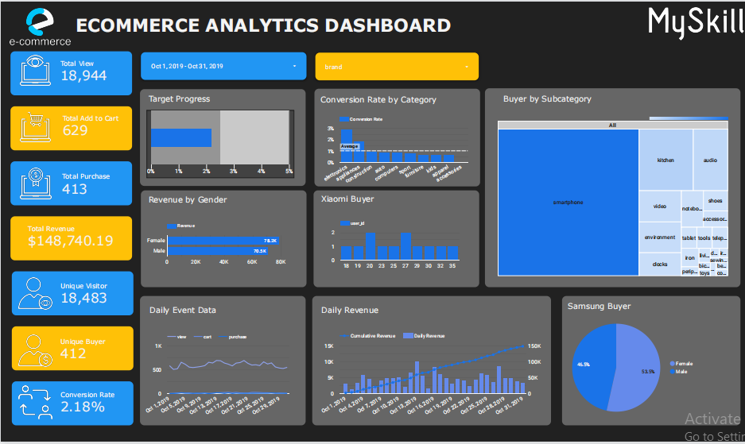

# Ecommerce Analytics Dashbord
## Work Environment
**Tools** : PostgreSQL 
**Programming Languange** : SQL 
**Visualization** : Google Data Studio
## Introduction
MySkill memberi saya proyek untuk membuat dasbor. Sebagai seorang data analyst, saya diminta untuk membantu tim bisnis menganalisa sebuah perusahaan e-commerce yang ingin melihat pertumbuhan konsumen.
## Objective
Buat dasbor analitik untuk mengetahui pertumbuhan pelanggan untuk perusahaan e-commerce.
## Visualization
Jika Anda ingin lebih interaktif, klik tautan. [disini](https://lookerstudio.google.com/reporting/44a91b05-bc22-4f80-a5c6-08cb1d97b604).

## Result
Dari dasbor yang sudah dibuat kita bisa lihat, pertumbuhan konsumen pada perusahaan e-commerce, ada 18.483 visitor yang berbeda pada bulan oktober dan total viewnya mencapai 18.944 yang artinya ada beberapa konsumen yang mengunjungi lebih dari satu kali. Jika kita lihat conversion ratenya mencapai 2.18% di bulan oktober sudah bagus tapi belum mencapai target.

Lalu total pembeli yang berbeda ada 412 dan total pembeli seluruhnya hanya selisih 1 angka yaitu 413, berarti ada satu konsumen yang melakukan pembelian lagi. Total pendapatan pada bulan oktober mencapai 148,740 dollar. Dari seluruh pembeli yang paling sering belanja adalah konsumen perempuan. Jika kita lihat perharinya, pendapatan paling tinggi jatuh pada tanggal 13 oktober sebesar 59,827 dollars. 

Aktifitas konsumen ketika mengunjungi website ecommerce ini dari conversian rate pada semua category yang ada, konsumen lebih tertarik pada category electronic jika kita kerucutkan lagi konsumen lebih tertarik membeli sebuah smartphone. Jika kita pecah pada smartphone, merek xiaomi kebanyakan pembelinya di rentang usia 20 hingga 27 thn. Lalu pada konsumen yang mebeli merek samsung kebanyakan perempuan.

Dalam hal ini upaya yang baik dalam mencapai target pada conversien rate agar konsumen lebih banyak mengunjungi ecommerce tersebut adalah membuat suatu promo yang menarik pembeli dari mulai potongan harga, gratis ongkos kirim dengan syarat tertentu, hingga dibuatkan bundle produk agar lebih menarik, dan banyak pengunjung dan pembelinya. lalu memberikan notifikasi kepada konsumen yang sudah menjadi member agar mereka terupdate dalam promo-promo yang menarik di ecommerce tersebut. Jika konsumennya laki-laki berikan informasi tentang barang male yang sedang promo atau rekomendasikan barang yang cocok untuk laki-laki dan sebaliknya jika konsumennya wanita berikan informasi promo dan barang khusus wanita yang sedang trand saat itu.